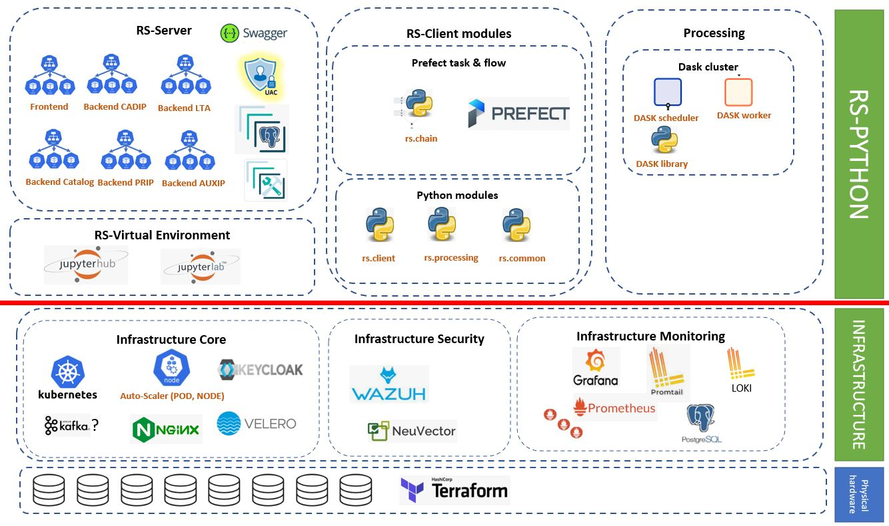

<!-- # Welcome to RS-Python documentation

The RS-Python documentation is composed from:

[RS-Server](rs-server/doc/index.md) -->

# Reference System Python

Reference System Python can be split into the following components:

-   **RS-Server**: The RS-Server controls user access to all sensitive
    interfaces: Catalog, LTA, ADGS, PRIP, CADIP. As a consequence, we
    can distinguish following components:

    -   **RS-Server Frontend**

    -   **RS-Server Backend / Catalog**

    -   **RS-Server Backend / PRIP**

    -   **RS-Server Backend / CADIP**

    -   **RS-Server Backend / LTA**

    -   **RS-Server Backend / AUXIP**

-   **RS-Client libraries**: this is a set of python functions that
    provide processing tasks and flows. Flows and tasks can be
    orchestrated by Prefect server or executed from any Python
    environment. On RS-Server side, there will be also a function to
    compute performance indicator.

-   **RS-Virtual environment**: Component that gives users access to
    computational environments and resources for executing processing
    chains.

-   **Processing**: this group hosts all components to process Sentinel
    products. The CFI are not part of the group. Only wrappers,
    preparation worker and Dask cluster provide processing power.
    Here are the components:

    -   **Dask cluster**

    -   **DPR libraries**

-   **Infrastructure**: The infrastructure is a portable, extensible and
    open-source platform orchestrated by Kubernetes. We can isolate two
    specific layouts: monitoring and security. As a consequence,
    we can distinguish the following components:

    -   **Infrastructure core**

    -   **Infrastructure monitoring**

    -   **Infrastructure security**

# Main components

The documentation for RS-Server may be found here [RS-Server](rs-server/docs/doc/index.md).

The documentation for RS-Client may be found here [RS-Client-Libraries](rs-client-libraries/docs/doc/index.md).

# Documentation how to
You may also check [how to generate](how_to.md) the documentation.
